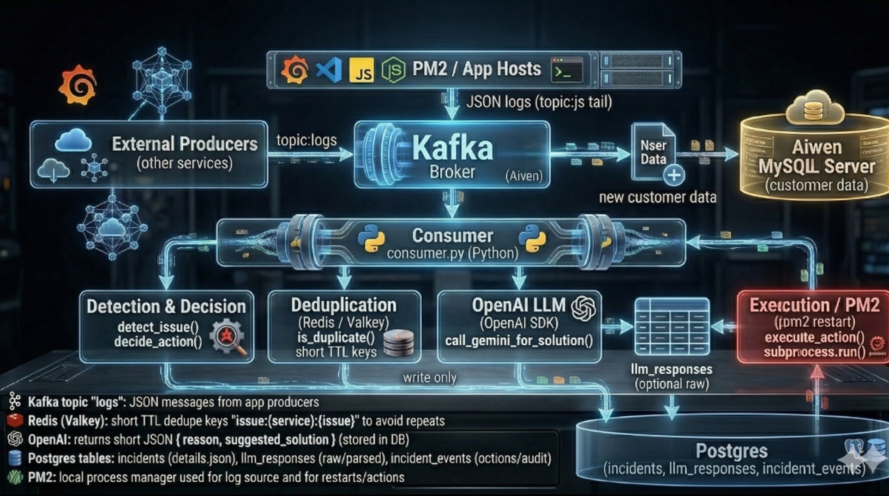

# Project Avien — Log Consumer & Incident Automation

[](https://github.com/)
[](LICENSE)

Short: tail PM2 logs → Kafka → Python consumer detects incidents → optional OpenAI suggestion → action via pm2 → incidents persisted in PostgreSQL. Redis (Valkey) used for short-term dedupe.

---

## Architecture (visual)
> Add your architecture image at `docs/architecture.png` and it will render here.



---


## Demo Video
Watch a short demo of the end-to-end flow (PM2 -> Kafka -> Consumer -> OpenAI -> Postgres):

[](https://youtu.be/s5hQOBz6Yys)

Direct link: https://youtu.be/s5hQOBz6Yys

A brief caption: This video demonstrates log ingestion from PM2, detection in the consumer, LLM suggestion retrieval, and incident persistence to PostgreSQL.

--- 

## Tags / Key components
- Kafka (Aiven)
- Python consumer (consumercopy.py)
- Node producer (app2.js)
- Redis (dedupe)
- PostgreSQL (incidents)
- OpenAI (LLM suggestions)
- PM2 (process manager / restart)

---

## Quickstart (local)

1. Install Python deps:
```bash
python -m venv .venv
# Windows PowerShell
.venv\Scripts\Activate.ps1
pip install -r requirements.txt
```

2. Configure environment (example `.env` or setx on Windows):
```powershell
setx OPENAI_API_KEY "sk_..."
setx OPENAI_MODEL "openai/gpt-oss-20b"
setx PGHOST "your_pg_host"
setx PGPORT "5432"
setx PGDATABASE "defaultdb"
setx PGUSER "dbuser"
setx PGPASSWORD "secret"
setx REDIS_HOST "redis.example.com"
setx REDIS_PORT "6379"
setx KAFKA_BROKERS "kafka-host:22770"
```
Restart terminal/IDE after setx.

3. Start Kafka/Redis/Postgres (locally or remote). Create DB table:
```sql
CREATE TABLE IF NOT EXISTS incidents (
  id BIGSERIAL PRIMARY KEY,
  created_at timestamptz DEFAULT now(),
  service_name text,
  issue text,
  action text,
  status text,
  details jsonb,
  raw_payload text,
  solution text
);
```

4. Run node producer (node-app):
```bash
cd node-app
npm ci
node app2.js
```

5. Run consumer:
```bash
python consumercopy.py
```

---

## Docker
Node producer Dockerfile: `node-app/Dockerfile`  
Python consumer Dockerfile: `Dockerfile` (project root)  
Sample compose available at `docker-compose.yml`.

Build & run:
```bash
# Build images
docker build -t project-avien-node-producer:latest ./node-app
docker build -t project-avien-consumer:latest .

# Or use docker-compose
docker-compose up --build
```
Mount Kafka certs into container at runtime (ca.pem, service.cert, service.key).

---

## Where to put your architecture image
Place your PNG or JPG at:
```
/c:/Users/visha/OneDrive/Desktop/project-avien/docs/architecture.png
```
or into the repository path `docs/architecture.png`. The README will reference that file.

---

## Debugging & troubleshooting
- Check consumer logs for:
  - "🔐 OpenAI SDK present" and "🔎 OpenAI returned raw text"
  - "🔔 LLM suggestion object"
- If `solution` is NULL:
  - ensure `incidents.solution` column exists
  - ensure `OPENAI_API_KEY` is visible to the consumer process
  - confirm save_incident._last_solution is set before insert
- Verify Kafka certs paths and connectivity if producer fails.

---

## Files of interest
- consumercopy.py — main consumer, detector, LLM caller, DB writer
- node-app/app2.js — PM2 log tailer & Kafka producer
- requirements.txt — Python dependencies
- node-app/package.json — Node dependencies
- Dockerfile, node-app/Dockerfile, docker-compose.yml — containers

---

## Presentation tip
- Use the architecture image full-screen.
- Live demo steps: push synthetic high-CPU log (app2 sends one), show consumer logs, then show a SQL query returning the inserted incident and solution.

---

## License
MIT — do not commit secrets to the repo.
